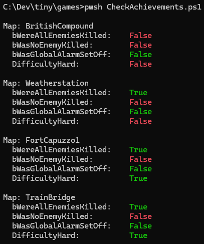

# commandos-achievements-script

Hacky script to show progress towards Commandos: Origins global achievements

## Background

When playing `Commandos: Origins` there are 3 global achievements that are difficult to
track using the UI. There's a great Steam community guide on how to find our progress
based on a `.sav` file contents, using a Hex Editor:

[How to Track Progress of 3 Global Achievements](https://steamcommunity.com/sharedfiles/filedetails/?id=3465222261) by
[KV](https://steamcommunity.com/profiles/76561198068871010)

I decided to try and codify it, to make it easier.

## Code

I wrote it in PowerShell so it should run on any Windows machine, just run:

``` cmd
pwsh -ExecutionPolicy Bypass -File "CheckAchievements.ps1"
```

Alternatively, you may run the `CheckAchievements.bat` batch file which calls the script with the appropriate arguments:

``` cmd
CheckAchievements.bat
```

## Output

It should find any completed maps, and show progress against the achievements:



## Contributors

Thanks to:

- [KV](https://steamcommunity.com/profiles/76561198068871010): original save file hex work, and updates to improve compatibility
- [bazsodombiandras](https://github.com/bazsodombiandras): PowerShell improvements
- [Zillu](https://steamcommunity.com/id/malcolmzillu27): Helping debug issues

## Disclaimer

The way it's written - it's really likely they'll "break" the script with a future update. Also, I've only completed 6 levels, it may break with later level names.

Be warned.
